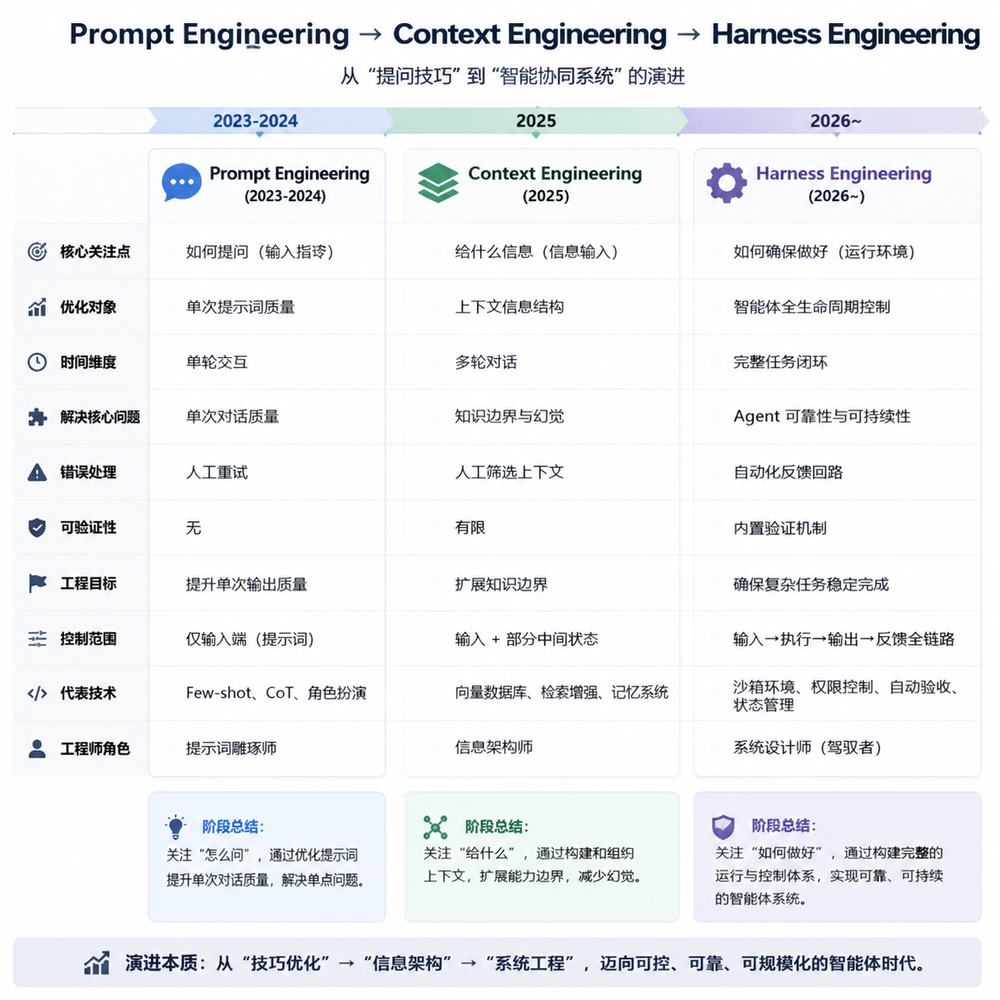
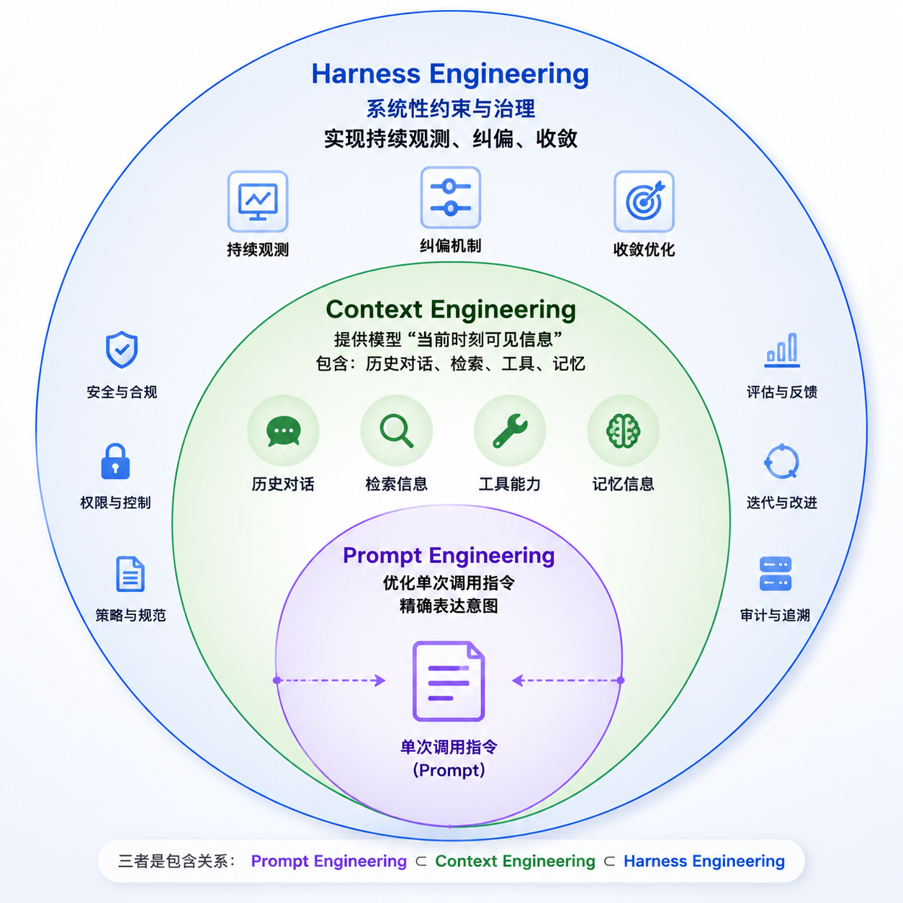

## 快速介绍

### 核心定义

- Harness，就是**除了 LLM 本身之外，让 Agent 真正能干活的一切基础设施**

- 简洁定义：**Agent = LLM + Harness**

- Harness Engineering 核心就是：**设计一个让Agent如何不再犯错的系统**


### 演进过程

- **阶段一：Prompt Engineering（提示词工程）**

  核心是**模型是否理解指令，通过提示词清晰表达任务，激发模型已有能力**

- **阶段二：Context Engineering（上下文工程）**

  核心是**模型是否获得足够且正确的信息，让模型基于完整信息决策**

- 阶段三：Harness Engineering（驾驭工程）

  核心是**模型在真实执行中是否稳定可靠，设计让 Agent 可靠写代码的「环境」**




### 三种 Engineering 联系

**三者是包含关系**




### 为什么需要 Harness Engineering

在使用 Agent 开发的时候，大家肯定遇到过以下问题：

**1. 上下文过长导致模型退化**

- **模型注意力被稀释**，上下文越长，模型要在更多 token 里找相关信息。虽然理论上能看长上下文，但实际生成时不一定能稳定抓到最关键的部分。
- **早期信息容易被弱化**，很多模型对最近内容更敏感。一开始定的规则、目标、人物设定、代码背景，到了后面可能被“冲淡”。
- **冲突信息会累积**，长对话里如果有反复修改、临时假设、废弃方案，模型可能不知道哪个是最新版本，导致混用。
- **任务边界变模糊**，一开始是 A 任务，后来夹杂 B、C、D，模型会越来越难判断“现在到底要做什么”。

**如何解决**

Agent 内置的作法是定期压缩上下文，每当上下文大小超过预定的窗口后，会自动进行压缩，但会带来第二个问题：


**2. 上下文压缩导致模型失真**

压缩后信息变少，但细节、语气、条件、因果关系可能丢失或变形

- **细节丢失**，原来有很多例外条件，摘要里只剩一句结论，比如原文是“通常用 A，但在 X/Y 情况下不用”，压缩后变成“使用 A”。
- **决策被误写成事实**，原本只是讨论过的方案，摘要后变成“已经决定采用”。
- **不确定性被抹平**，原文里说“可能”“待验证”“假设”，摘要后变成确定结论。
- **优先级丢失**，原文中某个限制是硬约束，摘要后变成普通建议。
- **语义漂移**，每次压缩都像“复述一遍”，多轮压缩后会越来越偏离原始意图，类似传话游戏。
- **代码/配置类信息被简化坏**，例如参数名、版本号、错误日志、边界条件、接口返回格式，一旦被摘要压缩，很容易失真。


**3. 模型长链路中自评失真，产出结果不理想**

- **自评和生成来自同一个偏差源**，如果生成答案时已经误解了任务，自评时通常也会沿着同样的误解继续判断
- **自评容易变成“合理化”**，模型生成后，会倾向于解释为什么自己的答案是合理的，而不是严格挑错
- **长链路会积累小偏差**，多步流程中，每一步偏一点，最后结果就偏很多。
- **自评容易忽略“原始需求”**，长链路后期，模型往往更关注自己刚写的结果，而不是最初的用户目标。


**Harness Engineering** 就是为了解决上述问题形成的一套方法论，下面会介绍一下如何落地。


### 如何落地 Harness Engineering

通过Open AI 和 Anthropic的实践，总结出了两个核心控制机制：

1. **引导（Guides/前馈控制）**

   在AI行动前设定的规则，如架构规范（CLAUDE.md）、代码约定、边界约束等。

2. **检测器（Sensors/反馈控制）**

   在AI行动后进行检查的机制，如自动化测试、代码检查（Lint）、持续集成/持续部署（CI/CD）流水线等。用于事后发现问题并进行修正。

**引导 -> Agent 执行 -> 检测反馈与修正 -> 引导 -> Agent 执行...** 真正形成一个闭环。


**Harness的分层框架**

```
Harness Engineering
├── Spec：目标、边界、验收标准
├── Context：代码库、文档、依赖、运行环境
├── Tools：编辑器、测试工具、浏览器、CI、部署工具
├── Feedback：测试结果、lint、review、用户反馈
├── Guardrails：权限、沙箱、回滚、审计
└── Evaluation：是否满足规格、是否产生回归
```

**每一层怎么落地**

- **Spec**：把需求变成可验收规格，内容包括目标、边界、非目标、验收标准、测试方式。

- **Context**：给 Agent 稳定上下文，不要每次把整个代码库塞给 Agent，而是维护Agents.md文件

  通常建议做法是将Agents.md拆分，Agents.md文件只做索引目录，实现**渐进式披露**，按需加载。主要指向以下文件

  ```markdown
  repo-map.md              代码结构说明
  architecture.md          核心模块关系
  coding-conventions.md    命名、测试、错误处理风格
  dependency-notes.md      主要依赖和版本约束
  ```

- **Tools**：明确 Agent 能用什么命令

- **Feedback**：把执行结果回传给 Agent。每个任务后都要求产出：

  ```markdown
  - 修改了哪些文件
  - 跑了哪些命令
  - 哪些测试通过
  - 哪些测试失败
  - 是否满足 Spec
  - 有哪些风险
  ```

- **Guardrails**: 限制 Agent 乱改，定好边界。通用边界：

  ```markdown
  ## Always
  - 修改前先读相关文件
  - 每个任务结束必须跑对应测试
  - 保持改动范围贴近 Spec
  
  ## Ask First
  - 新增依赖
  - 修改数据库 schema
  - 修改 CI/CD
  - 删除测试
  
  ## Never
  - 提交 secret
  - 删除失败测试来让 CI 通过
  - 重写无关模块
  ```

- **Evaluation**: 判断这次 Agent 执行是否合格。可以做一个简单评分表：

  ```markdown
  # Task Scorecard
  
  ## Spec Compliance
  - [ ] 完成所有验收标准
  - [ ] 没有实现超出范围的功能
  
  ## Code Quality
  - [ ] 代码符合项目风格
  - [ ] 没有明显重复或过度抽象
  
  ## Verification
  - [ ] lint 通过
  - [ ] test 通过
  - [ ] build 通过
  
  ## Risk
  - [ ] 无明显回归
  - [ ] 风险已记录
  ```


每个任务都按统一流程跑：

```markdown
input
→ spec.md
→ plan.md
→ task.md
→ code changes
→ test output
→ evaluation.md
```


**Harness 落地结构示例**

```
docs/
├── specs/
│   ├── feature-template.md
│   └── bugfix-template.md
├── context/
│   ├── repo-map.md
│   ├── coding-conventions.md
│   ├── architecture.md
│   └── dependency-notes.md
├── tools/
│   ├── commands.md
│   └── verification.md
├── guardrails/
│   ├── permissions.md
│   ├── boundaries.md
│   └── rollback.md
├── evals/
│   ├── acceptance-checklist.md
│   ├── regression-checklist.md
│   └── task-scorecard.md
└── runs/
    └── 2026-05-19-example-task/
        ├── input.md
        ├── plan.md
        ├── execution-log.md
        └── evaluation.md
```
